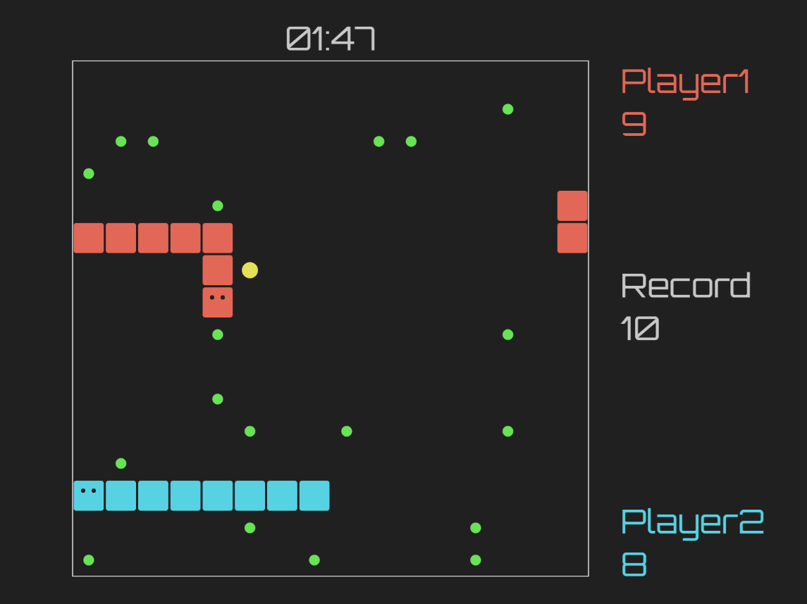

# js-snake
Little implementation of the game of snake for 1 of 2 players I built using <a href="https://p5js.org/">p5.js</a>.
## URL
This proyect is hosted by github pages at <a href="https://pabloqb2000.github.io/js-snake/">this link</a>.
## Modes
  - One player: control your player with W,A,S,D keys
  - Two players: control one player with W,A,S,D and the other with I,J,K,L
## Tuneable parameters
In the setup function all the paremeters are set so they can be easily changed from there. This paremeters are:
```
  introFade = 45;
	nCells = 16; // should be even
	cellSize = height/20;
	p1Color = color(227, 103, 86);
	p2Color = color(86, 210, 227);
	startLen = 4;
	record = startLen;
	foodChance = 0.08;
	superFoodChance = 0.005;
	superFoodPower = 5;
	foodColor = color(105, 227, 86);
	superFoodColor = color(227, 226, 86);
	fps = 6;
```
## Screenshot
</img>
## References
To find more information about the <b>awesome</b> library used for this proyect visit:
<a href="https://p5js.org/"> https://p5js.org/ </a>
